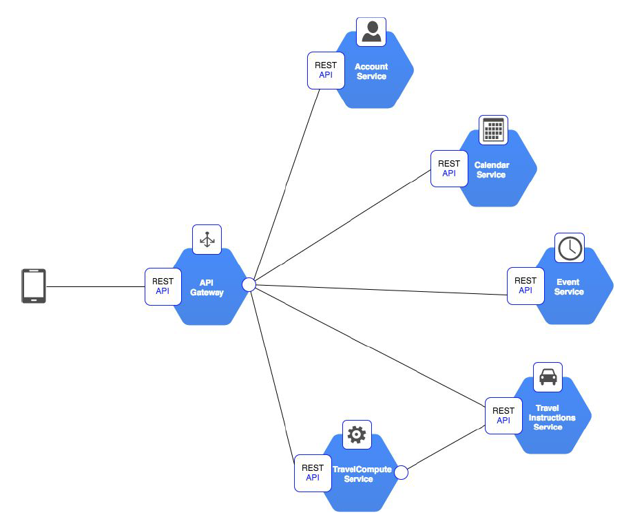

# Travlendar+

    

A mobile calendar-based application that automatically computes and accounts for travel time between appointments to make sure that the user is not late for them. Travlendar+ is based on an event-driven microservice architecture.

## Team Members
- Lorenzo Pratissoli
- Riccardo Novic

## Documents
- [RASD](documents/RASD.pdf)
- [DD](documents/DD.pdf)
- [ITD](documents/ITD.pdf)
- [ATD](documents/ATD.pdf)

## Instructions for deploying everything

- `git clone $this_repo`
- `cd k8s/`
- `sh kubernetes_deploy.sh`
- Copy the kong_setup.sh script inside the kong pod(KONG_POD='kong pod name assigned by kubernetes'): 
    `kubectl cp kong_setup.sh default/$KONG_POD:/`
- Run the script inside the kong pod:  
    `kubectl exec $KONG_POD -it bash` and
    `sh kong_setup.sh`
- Exit from the pod: 
    `exit`
- Get the external Travlendar ip address for the kong Proxy: 
    `kubectl get services | grep kong`
- Done
